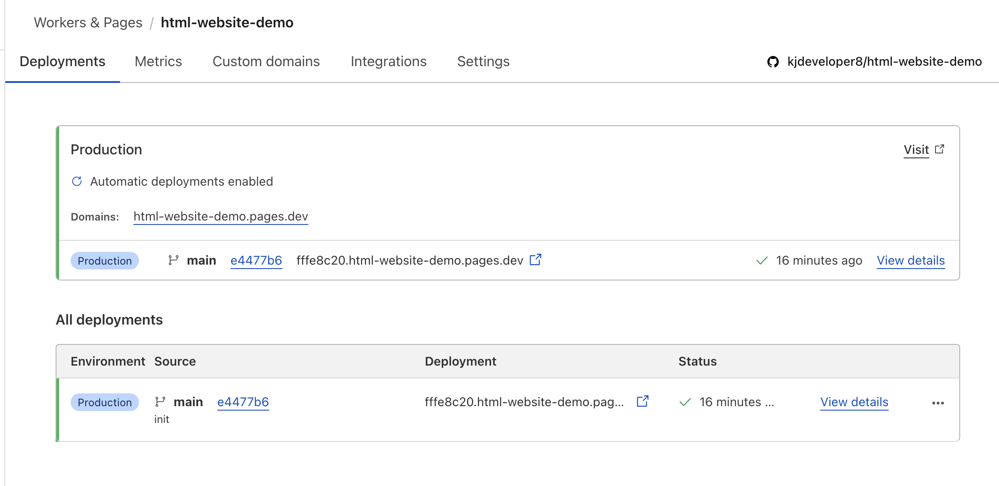

# HTML Website Demo

Simple static website demo (HTML, CSS, Markdown)


Directories
```
.
+-- README.md
+-- assets
│   \-- *.png
+-- css
│   \-- style.css
+-- display.html
+-- display2.html
+-- footer.html
+-- index.html
+-- md_pages
│   +-- intro.md
│   \-- lesson.md
\-- navigation.html
```

### How to build and deploy simple static website on cloudflare

1. Create html pages and build website with (*.html, *.css) files
   
2. Create your md files (*.md)
   
3. Import this script inside your header (within head tag)
   ``` <script type="module" src="https://cdn.jsdelivr.net/npm/zero-md@3?register"></script> ```

4. Link your md files 
   ``` <zero-md src="md_pages/intro.md"></zero-md> ```

    see [zero-md docs](https://zerodevx.github.io/zero-md/)

5. (Deployment) Go to your Cloudflare dashboard (free for pet-projects)
   
6. Go to Worker and Pages
   
   

7. Connect with your github or gitlab

   

   

8. Access repo you want to deploy (cloudflare supports both private and public repos)

   

9. Select your repo for deployment

   

10. Configure your deployment setup, see [docs](https://developers.cloudflare.com/pages/get-started/git-integration/).

   

11. Write your build settings, left empty in case of static html website

     

12. Now your deployment is running

     

13. Your website deploy successfully

     

> Note: Wait few minutes for DNS server to build sucessfully.


