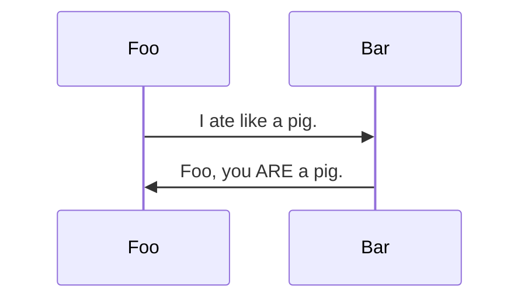

# Markdown Example


```yaml
title: "Page Title"
abstract: "YAML"
keywords: 
  - key1
  - key2
tags:
  - tag1
  - tag2
```

# list 

- list 1
- list 2
- list 3
- list 4
- list 5


And this is [sample link to lorem](https://www.lipsum.com/)

with **bold** text and *italic* word

let's check coding info

```python
import somepkg as pkg

def some_fun(params):
    return params

```


Again some random babbling text to test ...  \

#### Latex example

- $x + y$
- $x - y$
- $x \times y$ 
- $x \div y$
- $\dfrac{x}{y}$
- $\sqrt{x}$


## Notes

[^2]:
    Footnotes with multiple paragraphs

    Are indented in twice, and have line breaks between.

    - Markdown lists
    - work like this in footnotes
    - as well




#### table example

| 1st Header|2nd Header|3rd Header |
| ----------|:--------:|----------: |
| col 1 is|left-aligned|1 |
| col 2 is|center-aligned|2 |
| col 3 is|right-aligned|3 |


#### matrix example

$$
\begin{matrix}
1 & 2 & 3 \\
4 & 5 & 6 \\
7 & 8 & 9
\end{matrix}
$$


